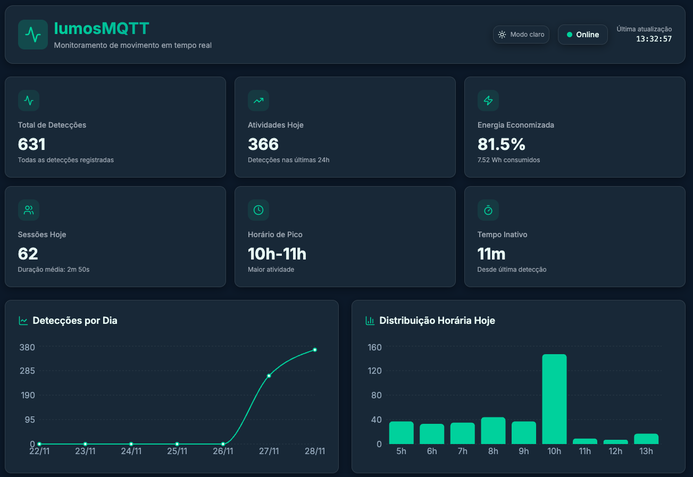

# 🌱 lumosMQTT – Iluminação Inteligente por Presença

> Projeto de Sistemas Embarcados – CESAR School  
> Professores: Bella Nunes • Jymmy Barreto

O **lumosMQTT** é um sistema IoT que monitora presença com **ESP32 + sensor PIR** e controla o brilho de um LED via PWM para economizar energia.  
Cada detecção gera um evento enviado por **MQTT** para um backend em **Flask**, que armazena os dados em **SQLite** e expõe uma API com métricas.  
Um **dashboard web em React** consome essas métricas e apresenta visualizações em tempo real.

O foco do projeto é mostrar, de ponta a ponta, um fluxo completo de sistemas embarcados + IoT + backend + visualização de dados.

## 1. Objetivos

- Utilizar o **ESP32** como nó embarcado (sensor + atuador).
- Detectar movimento usando **sensor PIR**.
- Controlar o LED por **PWM**, com:
  - modo de **alto brilho** quando há movimento recente;
  - modo de **baixo brilho (economia)** quando o ambiente está ocioso.
- Enviar eventos compactos via **MQTT** em formato JSON.
- Persistir eventos em um **banco SQLite** e calcular métricas avançadas:
  - total de detecções;
  - atividades no dia;
  - distribuição por horário;
  - sessões de presença;
  - tempo ocioso;
  - estimativa de energia consumida e economizada.
- Exibir todas as métricas em um **dashboard web em tempo real**.

## 2. Visão Geral do Sistema

### Arquitetura

```text
[ Sensor PIR ]        [ LED PWM ]
       │                    ▲
       ▼                    │
   ┌───────────┐     ┌──────┴──────┐
   │   ESP32   │     │   Mosquitto │
   │ (C++/RTOS)├────►│   MQTT      │
   └───────────┘ Wi-Fi└──────┬──────┘
                             │
                             ▼
                     ┌──────────────────┐
                     │ Flask Backend    │
                     │ + SQLite         │
                     └───────┬──────────┘
                             │ REST `/api/metrics`
                             ▼
                     ┌──────────────────┐
                     │ React Dashboard  │
                     └──────────────────┘
```

Fluxo resumido:

1. **ESP32** lê o sensor PIR (GPIO 27) em uma FreeRTOS task dedicada.
2. Quando ocorre uma borda de subida (LOW → HIGH), o firmware:
   - incrementa um contador local;
   - publica um JSON com o **timestamp** no tópico `lumosMQTT/motion`;
   - atualiza o brilho do LED (GPIO 4, PWM).
3. O **backend Flask** está inscrito no tópico `lumosMQTT/motion`, grava o evento no **SQLite** e recalcula métricas.
4. O **dashboard React** consulta periodicamente `GET /api/metrics`.

## 3. Organização do Repositório

Estrutura principal:

```bash
.
├── README.md           # Este arquivo (PT-BR)
├── README_EN.md        # Versão em inglês
├── docs/
│   └── projeto-embarcados.pdf   # Escopo/descrição fornecida na disciplina
├── esp32-esp8266/      # Firmware do ESP32 (PlatformIO)
│   ├── src/main.cpp
│   ├── include/env.h
│   ├── platformio.example.ini  # modelo sem credenciais
│   └── platformio.ini          # arquivo local criado a partir do exemplo
├── backend/            # Backend Flask + MQTT + SQLite
│   ├── app.py
│   ├── database.py
│   ├── mosquitto.conf
│   ├── requirements.txt
│   └── templates/index.html (opcional; não é o dashboard principal)
└── frontend/           # Dashboard web em React + Vite + Tailwind
    ├── src/
    │   ├── App.tsx
    │   ├── pages/
    │   └── components/
    ├── package.json
    └── vite.config.ts
```

## 4. Firmware do ESP32 (esp32-esp8266/src/main.cpp)

### Hardware

- Sensor PIR: GPIO 27
- LED (alto brilho): GPIO 4
- PWM configurado com:

  ```cpp
  static const int PIN_PIR = 27;
  static const int PIN_LED = 4;

  static const int LEDC_CHANNEL    = 0;
  static const int LEDC_FREQUENCY  = 5000; // 5 kHz
  static const int LEDC_RESOLUTION = 8;    // 0–255

  static const uint8_t BRIGHT_HIGH = 255;
  static const uint8_t BRIGHT_LOW  = 60;
  static const unsigned long MOTION_WINDOW_MS = 3000; // 3 s
  ```

### Comportamento

- Há uma FreeRTOS task `(taskSensors)` que, a cada ~300 ms:
  - lê o estado do PIR;
  - detecta borda de subida (LOW → HIGH);
  - envia evento MQTT;
  - atualiza `lastMotionMillis`;
  - chama `updateLedBrightness()`, que decide entre `BRIGHT_HIGH` e `BRIGHT_LOW` com base na janela de movimento de 3s.
- A função `loop()` mantém o cliente MQTT vivo `(mqttClient.loop())` e reconecta se necessário.

### Conexão Wi-Fi

#### Arquivo `platformio.ini` e credenciais

Por questões de segurança, o arquivo **`platformio.ini` real não é versionado no repositório** (ele está no `.gitignore`), pois contém dados sensíveis como:

- `WIFI_SSID`
- `WIFI_PASSWORD`
- endereço do broker MQTT (`MQTT_SERVER_ADDR` e `MQTT_SERVER_PORT`)

Em vez disso, o repositório inclui um arquivo de modelo:

- `esp32-esp8266/platformio.example.ini`

Para compilar o projeto em outra máquina, o passo é:

1. Copiar o arquivo de exemplo:

```bash
  cp esp32-esp8266/platformio.example.ini esp32-esp8266/platformio.ini
```

2. Editar o novo `platformio.ini` e preencher:
   - `WIFI_SSID` e `WIFI_PASSWORD` com o nome e a senha da sua rede Wi-Fi **(precisa ser 2.4 GHz)**;
   - `MQTT_SERVER_ADDR` com o **IP da máquina que está rodando o Mosquitto**.  
      Você pode descobrir seu IP local com:
      ```bash
      ip addr show
      ```
      ou, nas distros compatíveis:
      ```bash
      hostname -I
      ```
      ou ainda:
      ```bash
      ifconfig
      ```
   - `MQTT_SERVER_PORT` com a porta do broker (por padrão, `1883`).

> **Importante:** o ESP32 **só se conecta em redes Wi-Fi de 2.4 GHz**.  
> Se a rede for apenas 5 GHz, o dispositivo não conseguirá conectar.

### NTP

O código usa:

```cpp
configTime(-3 * 3600, 0, "pool.ntp.org", "time.nist.gov");
```

- Se o NTP sincroniza, o timestamp real (epoch) é usado.
- Se não sincronizar, há fallback para millis()/1000.

### MQTT

Tópicos definidos em `include/env.h`:

```cpp
#define TOPIC_STATUS "lumosMQTT/status"
#define TOPIC_MOTION "lumosMQTT/motion"
```

Uso real:

- Ao conectar, o ESP32 publica status = "online" em TOPIC_STATUS.
- A cada nova detecção, publica um evento em TOPIC_MOTION.

### Payload publicado

O ESP32 não envia métricas agregadas, apenas o evento bruto:

```json
{ "timestamp": 1732708465 }
```

Todo o resto (contagens, sessões, energia, tendências) é calculado no backend.

### Build e upload

Na pasta `esp32-esp8266/`:

```bash
# Compilar
pio run

# Compilar e enviar para o ESP32
pio run --target upload

# Monitor serial
pio device monitor
```

Você deve ver linhas como:

```text
[WiFi] Connected.
[WiFi] IP: 192.168.15.72
[TIME] NTP time synchronized!
[MQTT] Connecting to broker... connected.
System initialized. Waiting ~20s for PIR stabilization...
PIR ready!
[SENSOR] Motion detected. Local count: 1
[MQTT] Publishing motion event to lumosMQTT/motion: {"timestamp": 1764283214}
```

## 5. Backend – Flask + MQTT + SQLite (`backend/`)

### Broker MQTT (Mosquitto)

Arquivo de exemplo `backend/mosquitto.conf`:

```conf
# IPv4 – para o ESP32 (rede local)
listener 1883 0.0.0.0
allow_anonymous true

# IPv6 – para o backend Flask (localhost)
listener 1884 ::
allow_anonymous true
```

- ESP32 conecta em MQTT_SERVER_ADDR/MQTT_SERVER_PORT (ex.: 192.168.15.29:1883).
- Backend Flask, por padrão, conecta em ::1:1884 (localhost IPv6).

Iniciar broker (na pasta `backend/`):

```bash
mosquitto -c mosquitto.conf
```

### Banco de dados

Arquivo `database.py`:

- Banco: `motion.db` (SQLite).
- Tabela principal:

```sql
CREATE TABLE IF NOT EXISTS motion_events (
    id        INTEGER PRIMARY KEY AUTOINCREMENT,
    timestamp INTEGER NOT NULL,
    hour      INTEGER NOT NULL,
    day       TEXT NOT NULL
);
```

Funções principais:

- `insert_motion_event(timestamp)`
- `get_daily_count(day)`
- `get_total_count()`
- `get_hourly_distribution(day)`
- `get_peak_hour(day)`
- `get_events_for_day(day)`
- `get_daily_counts_for_range(start_day, end_day)`

### Cliente MQTT no backend (app.py)

- Conexão configurável via variáveis de ambiente:

```bash
# Exemplo (usando IPv6 localhost e porta 1884)
export MQTT_BROKER="::1"
export MQTT_PORT=1884
export MQTT_TOPIC_MOTION="lumosMQTT/motion"
```

- No `on_connect`, o cliente se inscreve em `MQTT_TOPIC_MOTION`.
- Cada mensagem recebida passa por `handle_motion_message(payload_str)`:
  - lê o `timestamp` enviado pelo ESP32 (apenas para log);
  - registra o horário do servidor (epoch atual);
  - insere o evento na tabela `motion_events`.

### Métricas expostas pela API

A rota `GET /api/metrics` calcula diversos indicadores diretamente do banco para o dia atual:

- `totalDetections`: total de eventos em toda a base.
- `detectionsByDay`: lista com os últimos 7 dias `[hoje, ontem, ...]`.
- `activitiesToday`: contagem de hoje (primeiro elemento de `detectionsByDay`).
- `hourlyDistribution`: mapa `{hora: quantidade}` para hoje (0–23).
- `peakHours`: intervalo `"19h-20h"` com maior atividade.

Métricas derivadas mais avançadas:

- `sessionsToday`:
  - `count`: número de sessões de presença (agrupar eventos com gap ≤ 120s);
  - `averageDurationSeconds`;
  - `maxDurationSeconds`.
- `idleMetrics`:
  - `maxIdleSeconds`: maior período sem movimento;
  - `lastEventAgeSeconds`: segundos desde o último evento (para hoje).
- `energyMetrics` (reconstrução das janelas de alto brilho):
  - `highSecondsToday` e `lowSecondsToday`;
  - `energyUsedWh`;
  - `energySavedPercent` (comparado a ficar sempre em alto brilho).
- `trends`:
  - `todayCount`, `yesterdayCount`, `weekAverage`;
  - `deltaVsYesterdayPercent`;
  - `deltaVsWeekPercent`.

Exemplo real de resposta:

```json
{
  "activitiesToday": 92,
  "detectionsByDay": [92, 0, 0, 0, 0, 0, 0],
  "energyMetrics": {
    "energySavedPercent": 83.02,
    "energyUsedWh": 10.2538,
    "highSecondsToday": 275,
    "lowSecondsToday": 72177
  },
  "hourlyDistribution": { "18": 34, "19": 52, "20": 6 },
  "idleMetrics": {
    "lastEventAgeSeconds": 58,
    "maxIdleSeconds": 67297
  },
  "peakHours": "19h-20h",
  "sessionsToday": {
    "averageDurationSeconds": 162.64,
    "count": 14,
    "maxDurationSeconds": 492
  },
  "totalDetections": 92,
  "trends": {
    "deltaVsWeekPercent": 600.0,
    "deltaVsYesterdayPercent": null,
    "todayCount": 92,
    "weekAverage": 13.14,
    "yesterdayCount": 0
  }
}
```

### Executando o backend

Na pasta backend/:

```bash
python3 -m venv venv
source venv/bin/activate        # Linux/macOS
# venv\Scripts\activate         # Windows

pip install -r requirements.txt

export MQTT_BROKER="::1"
export MQTT_PORT=1884

python app.py
```

Saída típica:

```text
[INFO] lumosMQTT-backend: Connecting to MQTT broker at ::1:1884...
[INFO] lumosMQTT-backend: Connected to MQTT broker ::1:1884
[INFO] lumosMQTT-backend: Subscribed to motion topic: lumosMQTT/motion
 * Running on http://127.0.0.1:5050
```

## 6. Dashboard Web (`frontend/`)



O dashboard é um SPA em React + Vite + TypeScript + Tailwind, com visual moderno (cards, gráficos, dark theme).

Ele consome a API do backend:

```ts
GET http://localhost:5050/api/metrics
```

### Principais componentes

- **Cards de resumo**:
  - Total de detecções;
  - Atividades hoje;
  - Energia economizada;
  - Sessões hoje;
  - Horário de pico;
  - Tempo inativo desde a última detecção.
- **Gráficos**:
  - Detecções por dia (últimos 7 dias);
  - Distribuição horária de hoje (gráfico de barras ou linhas);
  - Tendências vs ontem e vs média semanal.

### Como executar

Na pasta `frontend/`:

```bash
# Instalar dependências
npm install # ou pnpm install / bun install

# Rodar em modo desenvolvimento
npm run dev
```

O Vite normalmente sobe na porta `5173` (ou similar).
No navegador, acesse:

```text
http://localhost:5173
```

Certifique-se de que o backend Flask esteja rodando em `http://localhost:5050` para que as chamadas à API funcionem.

## 7. Execução End-to-End (resumo)

1. Subir o **broker MQTT**
   - Na pasta `backend/`:

```bash
    mosquitto -c mosquitto.conf
```

2. Iniciar o **backend Flask**

```bash
    cd backend
    source venv/bin/activate
    python app.py
```

3. Subir o **dashboard**

```bash
    cd frontend
    npm install
    npm run dev
```

4. Ligar o ESP32

   - Certificar que o `MQTT_SERVER_ADDR` em `platformio.ini` aponta para o IP da máquina com o Mosquitto.
   - Fazer upload do firmware e acompanhar o monitor serial.

5. Gerar movimento

- Movimentar-se em frente ao sensor PIR.
- Observar:

  - logs no Serial do ESP32;
  - linhas de `Stored motion event...` no backend;
  - atualização em tempo real no dashboard.

## 8. Como o projeto atende aos requisitos da disciplina

- Microcontrolador: ESP32 usado como plataforma principal, com código em C++/Arduino e utilização de FreeRTOS tasks.
- Sensores e atuadores: sensor PIR para presença e LED controlado por PWM para atuação visual/iluminação.
- Comunicação: uso de Wi-Fi e protocolo MQTT para integração com servidor externo.
- Servidor e persistência: backend em Flask conectado a um broker Mosquitto, com persistência em SQLite.
- Métricas e análise: cálculo de sessões de presença, tempo ocioso, distribuição horária e economia de energia.
- Interface gráfica: dashboard web dedicado, em React, apresentando métricas em tempo real.
- Organização profissional: repositório estruturado por módulos (`esp32-esp8266`, `backend`, `frontend`, `docs`), código comentado e README detalhado.

## 9. Melhorias Futuras

- Adicionar sensor de luminosidade (LDR) para combinar presença + luz ambiente.
- Criar alertas (e-mail, Telegram, etc.) para atividade fora de horário.
- Implementar autenticação no MQTT (usuário/senha, TLS) para ambiente de produção.
- Expor histórico completo com filtros por data e exportação em CSV/JSON.
- Permitir ajuste remoto de parâmetros (janela de movimento, brilho, limites de sessão).

## 10. Licença

- Projeto acadêmico desenvolvido para a disciplina de Sistemas Embarcados da CESAR School.
- O código pode ser reutilizado para fins educacionais, com os devidos créditos aos autores.
