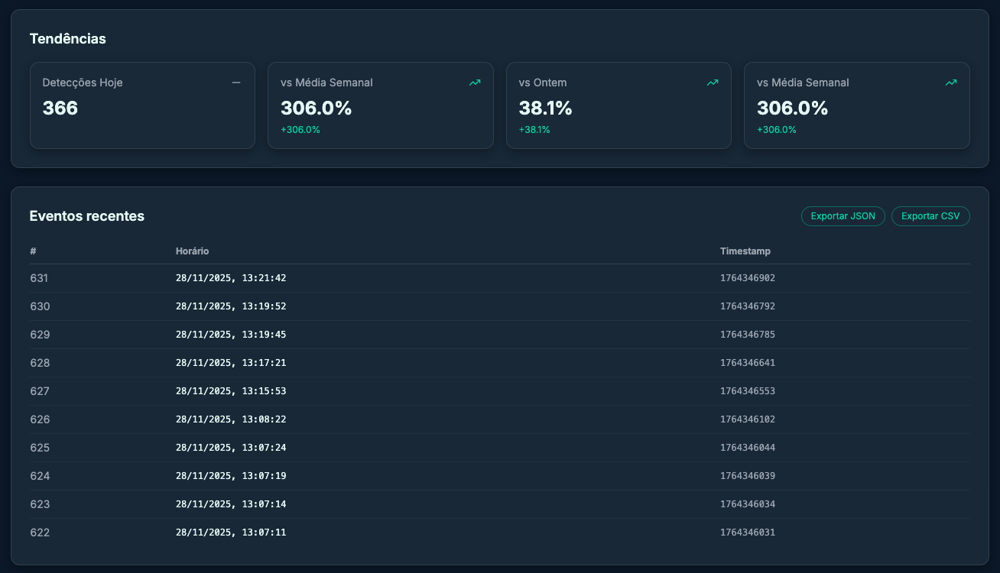

# 🌱 lumosMQTT – Smart Presence-Based Lighting

> Embedded Systems Project – CESAR School  
> Professors: Bella Nunes • Jymmy Barreto

**lumosMQTT** is an IoT system that monitors presence using an **ESP32 + PIR sensor** and controls LED brightness via PWM to save energy.  
Each detection generates an event sent via **MQTT** to a **Flask** backend, which stores the data in **SQLite** and exposes an API with metrics.  
A **React web dashboard** consumes these metrics and presents real-time visualizations.

The project's focus is to demonstrate, end-to-end, a complete flow of embedded systems + IoT + backend + data visualization.

## 1. Objectives

- Use the **ESP32** as an embedded node (sensor + actuator).
- Detect motion using a **PIR sensor**.
- Control the LED via **PWM**, with:
  - **high brightness** mode when there's recent motion;
  - **low brightness (energy-saving)** mode when the environment is idle.
- Send compact events via **MQTT** in JSON format.
- Persist events in a **SQLite database** and calculate advanced metrics:
  - total detections;
  - daily activities;
  - hourly distribution;
  - presence sessions;
  - idle time;
  - estimation of consumed and saved energy.
- Display all metrics on a **real-time web dashboard**.

## 2. System Overview

### Architecture

```text
[ PIR Sensor ]        [ LED PWM ]
       │                    ▲
       ▼                    │
   ┌───────────┐     ┌──────┴──────┐
   │   ESP32   │     │   Mosquitto │
   │ (C++/RTOS)├────►│   MQTT      │
   └───────────┘ Wi-Fi└──────┬──────┘
                             │
                             ▼
                     ┌──────────────────┐
                     │ Flask Backend    │
                     │ + SQLite         │
                     └───────┬──────────┘
                             │ REST `/api/metrics`
                             ▼
                     ┌──────────────────┐
                     │ React Dashboard  │
                     └──────────────────┘
```

Summary flow:

1. **ESP32** reads the PIR sensor (GPIO 27) in a dedicated FreeRTOS task.
2. When a rising edge occurs (LOW → HIGH), the firmware:
   - increments a local counter;
   - publishes a JSON with the **timestamp** to the `lumosMQTT/motion` topic;
   - updates the LED brightness (GPIO 4, PWM).
3. The **Flask backend** subscribes to the `lumosMQTT/motion` topic, stores the event in **SQLite**, and recalculates metrics.
4. The **React dashboard** periodically queries `GET /api/metrics`.

## 3. Repository Organization

Main structure:

```bash
.
├── README.md                         # Portuguese version (PT-BR)
├── README_EN.md                      # This file (EN)
├── docker-compose.yml                # Orchestrates mosquitto + backend + frontend
├── schematics/                       # Eletronic Diagrams
├── docs/
│   ├── projeto-embarcados.pdf        # Course scope/description
│   ├── pitch.pdf                     # Pitch
│   ├── Projeto_IoT_Grupo12.pdf       # Report
│   └── img/
│       ├── dashboard.png             # Dashboard screenshot
│       └── dashboard2.png            # Dashboard screenshot (variant)
├── esp32-esp8266/                    # ESP32 firmware (PlatformIO)
│   ├── src/main.cpp
│   ├── include/env.h
│   ├── platformio.example.ini        # Template without credentials
│   └── platformio.ini                # Local file created from example (not versioned)
├── backend/                          # Flask + MQTT + SQLite backend
│   ├── app.py
│   ├── database.py
│   ├── mosquitto.conf
│   ├── requirements.txt
│   ├── Dockerfile
│   ├── .env.example                  # Backend configuration template
│   └── templates/index.html          # (optional; not the main dashboard)
└── frontend/                         # React + Vite + Tailwind web dashboard
    ├── src/
    │   ├── App.tsx
    │   ├── pages/
    │   └── components/
    ├── package.json
    ├── vite.config.ts
    ├── Dockerfile
    └── .env.example                  # Template with VITE_API_BASE_URL
```

## 4. ESP32 Firmware (esp32-esp8266/src/main.cpp)

### Hardware

- PIR sensor: GPIO 27
- LED (high brightness): GPIO 4
- PWM configured with:

  ```cpp
  static const int PIN_PIR = 27;
  static const int PIN_LED = 4;

  static const int LEDC_CHANNEL    = 0;
  static const int LEDC_FREQUENCY  = 5000; // 5 kHz
  static const int LEDC_RESOLUTION = 8;    // 0–255

  static const uint8_t BRIGHT_HIGH = 255;
  static const uint8_t BRIGHT_LOW  = 60;
  static const unsigned long MOTION_WINDOW_MS = 3000; // 3 s
  ```

### Behavior

- There's a FreeRTOS task `(taskSensors)` that, every ~300 ms:
  - reads the PIR state;
  - detects rising edge (LOW → HIGH);
  - sends MQTT event;
  - updates `lastMotionMillis`;
  - calls `updateLedBrightness()`, which decides between `BRIGHT_HIGH` and `BRIGHT_LOW` based on the 3-second motion window.
- The `loop()` function keeps the MQTT client alive `(mqttClient.loop())` and reconnects if necessary.

### Wi-Fi Connection

#### `platformio.ini` file and credentials

For security reasons, the actual **`platformio.ini` file is not versioned in the repository** (it's in `.gitignore`), as it contains sensitive data such as:

- `WIFI_SSID`
- `WIFI_PASSWORD`
- MQTT broker address (`MQTT_SERVER_ADDR` and `MQTT_SERVER_PORT`)

Instead, the repository includes a template file:

- `esp32-esp8266/platformio.example.ini`

To compile the project on another machine, follow these steps:

1. Copy the example file:

```bash
  cp esp32-esp8266/platformio.example.ini esp32-esp8266/platformio.ini
```

2. Edit the new `platformio.ini` and fill in:
   - `WIFI_SSID` and `WIFI_PASSWORD` with your Wi-Fi network name and password;
   - `MQTT_SERVER_ADDR` with the **IP address of the machine running Mosquitto**.  
      You can discover your local IP with:
     ```bash
     ip addr show
     ```
     or, on compatible distros:
     ```bash
     hostname -I
     ```
     or alternatively:
     ```bash
     ifconfig
     ```
   - `MQTT_SERVER_PORT` with the broker port (default `1883`).

> **Important:** The ESP32 **only connects to 2.4 GHz Wi-Fi networks**.  
> If the network is 5 GHz only, the device won't be able to connect.

### NTP

The code uses:

```cpp
configTime(-3 * 3600, 0, "pool.ntp.org", "time.nist.gov");
```

- If NTP synchronizes, the real timestamp (epoch) is used.
- If it doesn't synchronize, there's a fallback to `millis()/1000`.

### MQTT

Topics defined in `include/env.h`:

```cpp
#define TOPIC_STATUS "lumosMQTT/status"
#define TOPIC_MOTION "lumosMQTT/motion"
```

Actual usage:

- Upon connecting, the ESP32 publishes `status = "online"` to `TOPIC_STATUS`.
- For each new detection, it publishes an event to `TOPIC_MOTION`.

### Published payload

The ESP32 doesn't send aggregated metrics, only the raw event:

```json
{ "timestamp": 1732708465 }
```

Everything else (counts, sessions, energy, trends) is calculated in the backend.

### Build and upload

In the `esp32-esp8266/` folder:

```bash
# Compile
pio run

# Compile and upload to ESP32
pio run --target upload

# Serial monitor
pio device monitor
```

Typical output:

```text
[WiFi] Connected.
[WiFi] IP: 192.168.15.72
[TIME] NTP time synchronized!
[MQTT] Connecting to broker... connected.
System initialized. Waiting ~20s for PIR stabilization...
PIR ready!
[SENSOR] Motion detected. Local count: 1
[MQTT] Publishing motion event to lumosMQTT/motion: {"timestamp": 1764283214}
```

## 5. Backend – Flask + MQTT + SQLite (`backend/`)

### MQTT Broker (Mosquitto)

`backend/mosquitto.conf` file:

```conf
# IPv4 – for ESP32 (local network)
listener 1883 0.0.0.0
allow_anonymous true

# IPv6 – for Flask backend (localhost)
listener 1884 ::
allow_anonymous true
```

#### Scenario 1 - All local (without Docker)

- ESP32 connects to `MQTT_SERVER_ADDR:MQTT_SERVER_PORT` (e.g., `192.168.15.29:1883`).
- Flask backend, by default, can connect to `::1:1884` (localhost IPv6) using:

```bash
    export MQTT_BROKER="::1"
    export MQTT_PORT=1884
    export MQTT_TOPIC_MOTION="lumosMQTT/motion"
```

In the `backend/` folder:

```bash
mosquitto -c mosquitto.conf
```

#### Scenario 2 - Stack with Docker Compose (recommended)

When using the `docker-compose.yml` from the root:

- The `mosquitto` service exposes port `1883` to the host.
- The `backend` service is configured via `backend/.env` to use:

```env
    MQTT_BROKER=mosquitto
    MQTT_PORT=1883
    MQTT_TOPIC_MOTION=lumosMQTT/motion
```

In other words, within the Docker network, the backend communicates with the broker via the hostname `mosquitto:1883`.

### Database

`database.py` file:

- The backend uses an SQLite file configured via the `DB_PATH` environment variable.

Example configuration in `.env` (inside the container):

```env
  DB_PATH=/app/lumos.db
```

In `docker-compose.yml`, the file is mapped from the host to the container, for example:

```yaml
volumes:
  - ./backend/lumos.db:/app/lumos.db
```

Main table:

```sql
CREATE TABLE IF NOT EXISTS motion_events (
    id        INTEGER PRIMARY KEY AUTOINCREMENT,
    timestamp INTEGER NOT NULL,
    hour      INTEGER NOT NULL,
    day       TEXT NOT NULL
);
```

Main functions:

- `insert_motion_event(timestamp)`
- `get_daily_count(day)`
- `get_total_count()`
- `get_hourly_distribution(day)`
- `get_peak_hour(day)`
- `get_events_for_day(day)`
- `get_daily_counts_for_range(start_day, end_day)`

### Environment variables (backend/.env)

The backend reads configuration from a `.env` file in the `backend/` folder.

The repository includes a template:

```bash
cp backend/.env.example backend/.env
```

Main variables:

```env
# MQTT
MQTT_BROKER=mosquitto        # service name in Docker Compose
MQTT_PORT=1883
MQTT_TOPIC_MOTION=lumosMQTT/motion

# Database (SQLite file inside the container)
DB_PATH=/app/lumos.db

# Logging
LOG_LEVEL=INFO

# HTTP Port
PORT=5050
```

When running with Docker Compose, these values are used automatically.
To run locally (without Docker), you can adjust `MQTT_BROKER` to the IP/host where Mosquitto is running.

### MQTT client in the backend (app.py)

- Configurable connection via environment variables:

```bash
# Example (using IPv6 localhost and port 1884)
export MQTT_BROKER="::1"
export MQTT_PORT=1884
export MQTT_TOPIC_MOTION="lumosMQTT/motion"
```

- In `on_connect`, the client subscribes to `MQTT_TOPIC_MOTION`.
- Each received message goes through `handle_motion_message(payload_str)`:
  - reads the `timestamp` sent by the ESP32 (for logging only);
  - records the server time (current epoch);
  - inserts the event into the `motion_events` table.

### Metrics exposed by the API

The `GET /api/metrics` route calculates various indicators directly from the database for the current day:

- `totalDetections`: total events in the entire database.
- `detectionsByDay`: list of the last 7 days `[today, yesterday, ...]`.
- `activitiesToday`: today's count (first element of `detectionsByDay`).
- `hourlyDistribution`: map `{hour: count}` for today (0–23).
- `peakHours`: interval `"19h-20h"` with highest activity.

More advanced derived metrics:

- `sessionsToday`:
  - `count`: number of presence sessions (grouping events with gap ≤ 120s);
  - `averageDurationSeconds`;
  - `maxDurationSeconds`.
- `idleMetrics`:
  - `maxIdleSeconds`: longest period without motion;
  - `lastEventAgeSeconds`: seconds since the last event (for today).
- `energyMetrics` (reconstruction of high brightness windows):
  - `highSecondsToday` and `lowSecondsToday`;
  - `energyUsedWh`;
  - `energySavedPercent` (compared to staying always at high brightness).
- `trends`:
  - `todayCount`, `yesterdayCount`, `weekAverage`;
  - `deltaVsYesterdayPercent`;
  - `deltaVsWeekPercent`.

Real response example:

```json
{
  "activitiesToday": 92,
  "detectionsByDay": [92, 0, 0, 0, 0, 0, 0],
  "energyMetrics": {
    "energySavedPercent": 83.02,
    "energyUsedWh": 10.2538,
    "highSecondsToday": 275,
    "lowSecondsToday": 72177
  },
  "hourlyDistribution": { "18": 34, "19": 52, "20": 6 },
  "idleMetrics": {
    "lastEventAgeSeconds": 58,
    "maxIdleSeconds": 67297
  },
  "peakHours": "19h-20h",
  "sessionsToday": {
    "averageDurationSeconds": 162.64,
    "count": 14,
    "maxDurationSeconds": 492
  },
  "totalDetections": 92,
  "trends": {
    "deltaVsWeekPercent": 600.0,
    "deltaVsYesterdayPercent": null,
    "todayCount": 92,
    "weekAverage": 13.14,
    "yesterdayCount": 0
  }
}
```

### Other useful endpoints

Besides `/api/metrics`, the backend exposes:

- `GET /api/health`

  - Returns the basic status of the backend and database. Useful for health checks.

- `GET /api/events?limit=N`

  - Lists the most recent motion events, ordered from newest to oldest.
  - Used by the dashboard to populate the Recent Events table.

- `GET /api/events/export?limit=N`
  - Exports events in CSV format (`text/csv`), allowing download of history for external analysis.

### Running the backend (without Docker)

In the `backend/` folder:

```bash
python3 -m venv venv
source venv/bin/activate        # Linux/macOS
# venv\Scripts\activate         # Windows

pip install -r requirements.txt

cp .env.example .env            # create configuration file
# edit .env if necessary (MQTT_BROKER, DB_PATH, etc.)

python app.py
```

Typical output:

```text
[INFO] lumosMQTT-backend: Connecting to MQTT broker at ::1:1884...
[INFO] lumosMQTT-backend: Connected to MQTT broker ::1:1884
[INFO] lumosMQTT-backend: Subscribed to motion topic: lumosMQTT/motion
 * Running on http://127.0.0.1:5050
```

## 6. Web Dashboard (`frontend/`)




The dashboard is a SPA in **React + Vite + TypeScript + Tailwind**, with modern visuals (cards, charts, dark/light theme).

It consumes the backend API:

```ts
GET http://localhost:5050/api/metrics
GET http://localhost:5050/api/events
GET http://localhost:5050/api/events/export
GET http://localhost:5050/api/health
```

### Environment Variables (`frontend/.env`)

The frontend reads the base API URL from the `.env` file in the `frontend/` folder.

```bash
cp frontend/.env.example frontend/.env
```

Default content:

```env
VITE_API_BASE_URL=http://localhost:5050
```

If you run the backend on another URL/port or in a production environment, just adjust this value.

### Main components

- **Header**:
  - System title, connection status (`Online/Offline`) based on `/api/health`;
  - Displays the last metrics update;
  - Theme toggle button (light/dark) with persistence in `localStorage` and application to the `<html>` tag (`class="dark"`).
- **Summary cards**:
  - Total detections;
  - Activities today;
  - Energy saved;
  - Sessions today;
  - Peak hours;
  - Idle time since last detection.
- **Charts (Recharts)**:
  - Detections by day (last 7 days);
  - Hourly distribution for today (bar chart);
  - Trends vs yesterday and vs weekly average.
- **Trends**:
  - Cards showing:
    - Detections today;
    - Weekly average;
    - Percentage difference vs yesterday;
    - Percentage difference vs weekly average.
- **Recent events table**:
  - Lists the latest motion events directly from `GET /api/events`;
  - Displays id, time (formatted in `pt-BR`), and raw timestamp;
  - Includes buttons to export history:
  - Export JSON: downloads `motion_events.json` with raw data;
  - Export CSV: downloads `motion_events.csv` ready to open in Excel/Sheets.

### How to run (without Docker)

In the `frontend/` folder:

```bash
# Install dependencies
npm install      # or pnpm install / bun install

# Run in development mode
npm run dev
```

Vite typically starts on port `5173` (or similar).

In the browser, access:

```text
http://localhost:5173
```

Make sure the Flask backend is running on `http://localhost:5050` and that `VITE_API_BASE_URL` in .env points to that URL.

## 7. Execution with Docker (recommended)

The repository includes a `docker-compose.yml` at the root that brings up the entire stack:

- `mosquitto` – MQTT broker;
- `lumos-backend` – Flask backend + SQLite;
- `lumos-frontend` – React dashboard served by Nginx.

At the project root:

```bash
docker compose build
docker compose up
## or
docker-compose up --build
```

Services and ports:

- Mosquitto (MQTT): `localhost:1883`
- Flask Backend: `http://localhost:5050`
- Frontend (Nginx + React build): `http://localhost:5173`

Access the dashboard at:

```text
http://localhost:5173
```

Before running for the first time:

```bash
cp backend/.env.example backend/.env
cp frontend/.env.example frontend/.env
```

> Make sure the ESP32 is configured to point `MQTT_SERVER_ADDR` to the IP address of the machine where Docker is running (port `1883`).

## 8. End-to-End Execution (manual mode, without Docker)

1. Start the **MQTT broker**
   - In the `backend/` folder:

```bash
    mosquitto -c mosquitto.conf
```

2. Start the **Flask backend**

```bash
  cd backend
  python3 -m venv venv
  source venv/bin/activate         # Linux/macOS
  # venv\Scripts\activate          # Windows

  cp .env.example .env             # if it doesn't exist yet
  # edit .env if necessary (MQTT_BROKER, DB_PATH, etc.)

  python app.py
```

3. Start the **dashboard**

```bash
  cd frontend
  cp .env.example .env             # ensure VITE_API_BASE_URL is correct
  npm install
  npm run dev

```

4. Turn on the ESP32

   - Make sure `MQTT_SERVER_ADDR` in `platformio.ini` points to the IP of the machine with Mosquitto.
   - Upload the firmware and monitor the serial output.

5. Generate motion

- Move in front of the PIR sensor.
- Observe:
  - logs in the ESP32 Serial;
  - `Stored motion event...` lines in the backend;
  - real-time updates in the dashboard.

## 9. How the project meets the course requirements

- **Microcontroller**: ESP32 used as the main platform, with C++/Arduino code and FreeRTOS tasks.
- **Sensors and actuators**: PIR sensor for presence and LED controlled by PWM for visual/lighting actuation.
- **Communication**: use of Wi-Fi and MQTT protocol for integration with external server.
- **Server and persistence**: Flask backend connected to a Mosquitto broker, with SQLite persistence.
- **Metrics and analysis**: calculation of presence sessions, idle time, hourly distribution, and energy savings.
- **Graphical interface**: dedicated web dashboard in React, presenting real-time metrics.
- **Professional organization**: repository structured by modules (`esp32-esp8266`, `backend`, `frontend`, `docs`), commented code, use of `.env/.env.example`, Dockerfiles, and detailed README.

## 10. Future Improvements

- Add a light sensor (LDR) to combine presence + ambient light.
- Create alerts (email, Telegram, etc.) for activity outside of hours.
- Implement MQTT authentication (username/password, TLS) for production environment.
- Improve event history with filters by date/time range in the API and dashboard (CSV/JSON export is already available in the current version).
- Allow remote parameter adjustment (motion window, brightness, session limits).
- Create a "web flasher" for the ESP32 (via ESP Web Flasher or esptool.py + script) allowing firmware flashing directly from the browser.

## 11. License

This project is licensed under the terms of the MIT license – see the [LICENSE](LICENSE) file for more details.

- Academic project developed for the Embedded Systems course at CESAR School.
- The code can be reused for educational purposes, with proper credits to the authors.
